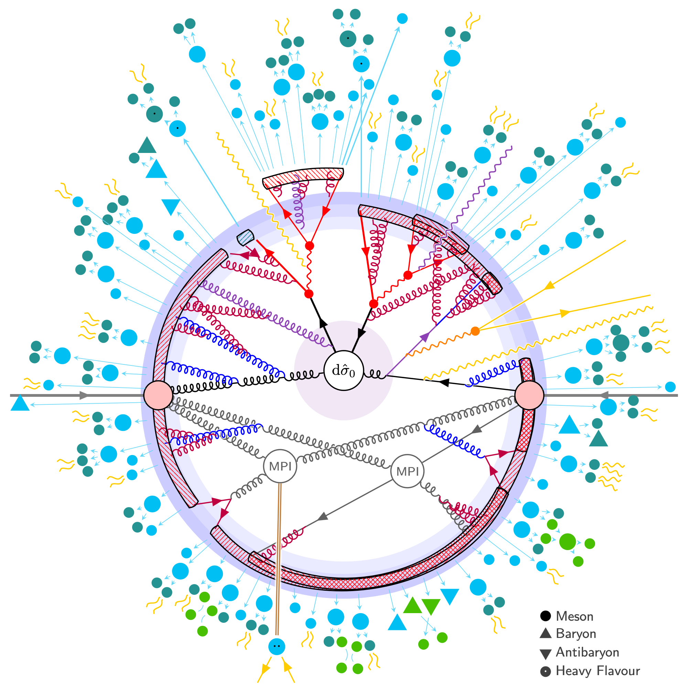

This exercise introduces Monte Carlo event generators and how they are used in high energy physics,
focusing on the workflows used in CMS.

The information and exercises are based on the [2022 CMSDAS](https://twiki.cern.ch/twiki/bin/view/CMS/SWGuideCMSDataAnalysisSchoolLPC2022GeneratorsExercise#Task_1_Using_standalone_MG5) as well as the
[Generator HATS 2021](https://twiki.cern.ch/twiki/bin/viewauth/CMS/GeneratorsHATSatLPC2021).
It has been extended to cover new tools like [NanoGEN](https://twiki.cern.ch/twiki/bin/viewauth/CMS/NanoGen) and introduce generator-related systematic uncertainties.

<!-- this is an html comment -->

 This is a comment in Liquid 

> ## Prerequisites
>
> Make sure you have a working LPC computing account and are familiar with [basic linux commands](https://twiki.cern.ch/twiki/bin/view/CMSPublic/WorkBookBasicLinux).
> A grid certificate is needed for some of the CMS tools (e.g. McM and DAS).
{: .prereq}


